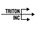

# Triton
Nós da Triton Inc, somos jovens programadores da GerminareTECH e temos o objetivo de criar jogos envolventes e de alta qualidade.

# Links de Desenvolvimento
* Artes visuais do Figma: https://www.figma.com/design/U68WI9LYpewIm4N8yZez7f/Triton?node-id=0-1&t=eY3yYOwOAum5fH6W-0
* Estilos CSS [aqui](./assets/style/pallete.css)

# Licença
O projeto está licenciado sobre a MIT, [veja-a aqui](LICENSE)

# Empresa
### Pessoas
* Vitor Augusto Ponciano Carvalho
* Felipe Fernandes dos Santos Oliveira
* Lucas Taxiotti

### Sobre nós
Somos uma marca brasileira que nasceu com o objetivo de deixar o dia das pessoas mais alegre e divertido por meio de jogos online. Estamos presentes nas redes brasileiras. Nossa equipe consiste de jovens programadores da GerminareTECH. Acreditamos na criatividade e na dopamina, somos altamente sustentáveis. Procuramos criar valor para todos em qualquer lugar através do advento da tecnologia online.

